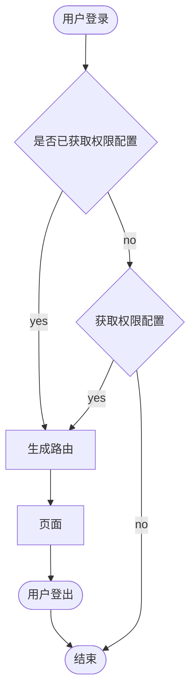
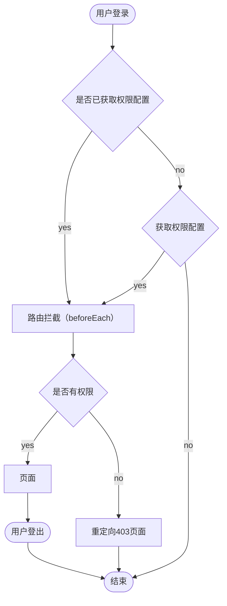

最近群里在问权限应该怎么设计，用什么方案合适。说实话我很早前第一次做权限的时候也栽进坑里过

<!-- more -->

## 权限方案

权限无非就是限制 页面的展示 或则 某个组件的展示，总结下来就是 :

- `C` 创建
- `U` 更新(编辑)
- `R` 读取(查询)
- `D` 删除

`C` 数据是否可以被创建，限制初始化某功能（权限独立）

`R` 数据是否可以被查询，限制页面 or 组件查看（权限独立）

`U` 数据是否可以被更新，限制数据更新，可查询数据 （联合权限`R`）

`D` 数据是否可以被删除，限制数据删除，可查询可更新（联合权限`R` `U`）

上述是后端数据权限总结

目前我已知前端方案有:

### 动态路由

菜单 页面 单独存放，请求后端返回 router 配置信息登录时 一次性生成route配置 addRoute，登出时重置为默认 router

技术细节：



首先

动态生成路由 比较麻烦

路由书写不能像官网示例那样 一个一个 import('xxx')，需要动态遍历组合生成路由

_仅供参考:_

```ts
/* 权限数据结构 */
interface Permission {
  id: number
  parentId: number | null
  path: string
  name: string
  /**
   * 组件名称
   * 组件具体的路径
   * @example `component = 'product/detail.vue'` `src/views/${component}`
   */
  component: string
}

interface PermissionRoute {
  id: number
  parentId: number | null
  parentName?: string
  route: RouteRecordRaw
}

const permissionMap = new Map<number, Permission>(permission.map(item => [item.id, item]))

function createRoute(permission: Permission) {
  const asyncRoute: PermissionRoute = {
    id: item.id,
    parentId: item.parentId,
    parentName: permissionMap.get(item.id)?.name,
    route: {
      name: item.name,
      redirect: item.redirect,
      path: item.path,
      component: () => import(`@/views/${item.component}`)
    }
  }

  return asyncRoute
}

const routers = [
  { path: '/403', name: 'Qianli403', meta: { hidden: true }, props: { status: 403 }, component: ErrorView },
  { path: '/404', name: 'Qianli404', meta: { hidden: true }, props: { status: 404 }, component: ErrorView },
  { path: '/:catchAll(.*)', redirect: '/404', meta: { hidden: true } }
]

function generateRoute(permission: Permission[], router: Router) {
  const asyncRouters = permission.map(createRoute)

  for (asyncRoute of asyncRouters) {
    router.addRoute(asyncRoute.parentName, asyncRoute.route)
  }

  for (route of routers) {
    router.addRoute(route)
  }
}

const router = createRouter({
  history: createWebHistory(import.meta.env.BASE_URL),
  routes: [
    { path: '/', name: 'QianliRoot', meta: { hidden: true }, redirect: '/dashboard/workplace' },
    {
      path: '/login',
      name: 'QianliLogin',
      meta: { hidden: true, title: '登录' },
      props: route => ({ redirect: route.query.redirect }),
      component: () => import('@/views/login/index.vue')
    }
  ]
})
```

其次

props 问题：

我们可以看到 ，手动组合 route 配置，且 props 没办法 手动指定，只能 props: true，这样是能解决问题 但是，对于一个健壮的项目来讲 这种 是不可取的

再者 meta 问题：

meta 通常会存一些跟页面相关的数据，难道这部分数据也要配置在后台？

解决办法：

当然上述说的 props 和 meta 问题可以解决，但是比较麻烦。需要在本地 有个配置做关联，生成路由时挂进去即可

但是挺费劲的

```ts
type RouteConfig = Omit<RouteRecordRaw, 'component' | 'path' | 'name'>

const route = {
  props: route => ({ id: route.query.id }),
  meta: { title: 'xxxx' }
}

export default route
```

渲染菜单

```ts
interface PermissionMenu {
  title: string
  path: string
  children: PermissionMenu[]
}
```

通过 router.options.routes [^vue-router4] 获取 整个 router 配置树

写个递归组件渲染即可不再赘述

### 路由钩子

菜单 = 页面 不需要配置多份数据 静态路由，路由 name 作为权限码（name必须唯一）登录时返回用户权限列表，每次在 `router.beforeEach` 时 判断权限 做鉴权跳转

#### 权限命名规范

路由 name 名称 采用 `帕斯卡` 命名法

模块

`Product`

模块->页面

`ProductDetail`

prefix->模块->页面->按钮功能

`btn_ProductDetail_submit`

考虑到方便 cv 页面权限名称，故采用 `下划线 + 帕斯卡 + 下划线` 命名法

#### 技术细节



首先

路由配置 官网示例怎么写就怎么写即可，不需要动态生成 router 配置

_仅供参考:_

```ts
// ./modules/user.ts
import type { RouteRecordRaw } from 'vue-router'
import Layout from '@/layout/index.vue'
import { SupervisedUserCircleRound } from '@vicons/material'

export const userRoute: RouteRecordRaw = {
  path: '/user',
  name: 'QianliUser',
  component: Layout,
  redirect: '/user/list',
  meta: { title: '用户管理', icon: SupervisedUserCircleRound, noShowingChildren: true },
  children: [
    {
      path: 'list',
      name: 'QianliUserList',
      meta: { activeMenu: '/user', title: '用户列表' },
      component: () => import('@/views/user/list/index.vue')
    }
  ]
}
```

模块化更清晰管理

```ts
import { createRouter, createWebHistory } from 'vue-router'
import ErrorView from '@/views/error/index.vue'
import { dashboardRoute } from './modules/dashboard'
import { userRoute } from './modules/user'
import { postRoute } from './modules/post'
import { productRoute } from './modules/product'
import { systemRoute } from './modules/system'
import { feedbackRoute } from './modules/feedback'
import { jobRoute } from './modules/job'
import { activityRoute } from './modules/activity'

const router = createRouter({
  history: createWebHistory(import.meta.env.BASE_URL),
  routes: [
    { path: '/', name: 'QianliRoot', meta: { hidden: true }, redirect: '/dashboard/workplace' },
    {
      path: '/login',
      name: 'QianliLogin',
      meta: { hidden: true, title: '登录' },
      props: route => ({ redirect: route.query.redirect }),
      component: () => import('@/views/login/index.vue')
    },
    dashboardRoute,
    postRoute,
    productRoute,
    feedbackRoute,
    userRoute,
    jobRoute,
    activityRoute,
    systemRoute,
    { path: '/403', name: 'Qianli403', meta: { hidden: true }, props: { status: 403 }, component: ErrorView },
    { path: '/404', name: 'Qianli404', meta: { hidden: true }, props: { status: 404 }, component: ErrorView },
    { path: '/:catchAll(.*)', redirect: '/404', meta: { hidden: true } }
  ]
})

export default router
```

其次

鉴权函数

```ts
// utils/permission.ts
export interface UserPower {
  web_route: string
}

export function hasPermission(permission?: string | null) {
  const permissionPower: ReadonlyArray<UserPower> = whiteList.concat(userModule.user_power)
  if (!permission) return true

  if (permissionPower.filter(item => item.web_route === permission).length) {
    return true
  }

  return false
}
```

router拦截

```ts
import router from '.'
import NProgress from 'nprogress'
import 'nprogress/nprogress.css'

import { hasPermission, userModule } from '@/store/modules/user'
import { appModule } from '@/store/modules/app'

NProgress.configure({ showSpinner: false })

const whiteList: ReadonlyArray<string> = ['/login', '/404', '/403', '/dashboard'] // no redirect whitelist

/**
 * 首先判断是否有登录 没有登录 则 跳转到 登录页面
 * 有登录 判断是否已获取过权限列表 没有获取 则 等待获取
 * 判断 要去的路由是否是登录页面 是 则 重定向 /dashboard
 * 否则 判断要去的路由是否是白名单页面 是 则 放行
 * 否则 鉴权路由 通过 则 放行
 * 否则 重定向到 /403
 */
router.beforeEach(async (to, _, next) => {
  NProgress.start()

  const token = appModule.token

  if (token) {
    // 判断是否已获取过权限列表
    if (!userModule.dispatched) {
      try {
        await userModule.dispatchAuth()
      } catch {
        await userModule.LogOut()
        appModule.REMOVE_TOKEN()
        next('/login')
        return
      }
    }

    if (to.path === '/login') {
      next({ path: '/dashboard', replace: true })
    } else if (whiteList.indexOf(to.path) > -1) {
      next()
    } else if (hasPermission(to.name)) {
      next()
    } else {
      next({ path: '/403' })
    }
  } else if (to.path === '/login') {
    next()
  } else {
    next({ path: '/login', query: { redirect: to.fullPath }, replace: true })
  }
})
```

最后渲染 菜单

通过 router.options.routes [^vue-router4] 获取 整个 router 配置树

写个递归组件渲染即可，是否渲染菜单 则需要通过 `hasPermission` 方法判断 当前 route.name (权限key) 具体代码不再赘述

## 总结

**动态路由：**

可以实现但是过程过于复杂，如果我更改了 组件目录 必须要同步更新到 后台，这种关联性太强了，**强烈不推荐**使用这种方式

**路由钩子：**

实现过程不复杂，简单、直接，主要在 router 拦截稍微绕了点总体还好 **强烈推荐**采用此方式

[^vue-router4]: [vue-router4](https://router.vuejs.org/zh/api/interfaces/RouterOptions.html#Properties-routes)
